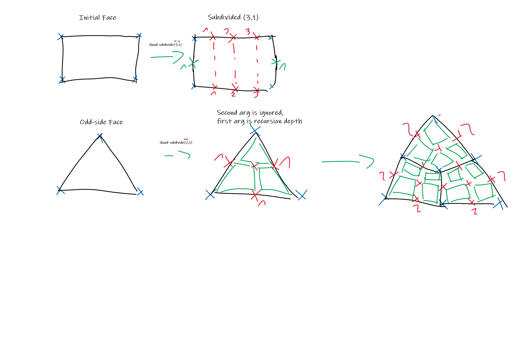

# S7 Programming and Simulation FEM-ready mesh implementation

For the Semester Programm *Programming and Simulation* we are developing a *FEM-ready* mesh class to run some simple simulations.

## Design thoughts

A mesh face should be subdividable, with custom *-maybe multiple different-* subdivision algorithms. This could allow for design iterations and design evaluations.
For *FEM*, we need to be able to efficiently query node-edge-face connections and also find neighbours for all nodes / edges / faces.
The mesh should support *CRUD* operations on Nodes, Edges and Faces

## Prerequisites

This library uses [rhino3m](https://pypi.org/project/rhino3dm/) for it's *IO* to *Rhinoceros3d*. If you want to use with a custom *IO*, this package is not needed.
Internally, the vertices are stored as *numpy* vectors, so you need to install *numpy*, too.

Notably, this library **does not** rely on [Rhinocommon](https://developer.rhino3d.com/guides/rhinocommon/what-is-rhinocommon/), so it can be run as a **standalone** application, with only *open-source* and *free* libraries as dependencies.

## How to use

For now there are 2 main python scripts to execute:

 1. `run_task.py`, which runs the current implementation of the task details
 2. `run_tests.py` which runs all tests defined in the project

```shell
# inside of project_dir
python run_task.py
python run_tests.py
```

## Structure

The project is divided in `src`, for all the module logic and `tests` for all the tests.

src
 ┣ `buffers.py`
 ┣ `geometry.py`
 ┣ `mesh.py`
 ┣ `rhino_io.py`
 ┗ `task.py`

## Implemented

Keeping track of what is already implemented, and what is still left do be desired

### Buffers

Buffers are collections of mesh elements that need to be kept in sync.

 - [x] `OneToManyConnectionTable` -> Convenience one-to-many mapping
 - [x] `NodeBuffer` -> Collection of nodes in space
   - [x] `self.add_vertex()`
   - [x] `self.remove_vertex()`
   - [x] `self.remove_node()`

### Kernel

The `Kernel` stores all buffers and allows for operations that have to touch multiple buffers, like adding a new face from it's vertices. It can also link *vertices* to *faces* as a *One-to-One* relationship, and *nodes* to *faces* as a *One-To-Many* relationship, although I'm not sure if this is actually needed.

The methods we need to implement on `Kernel` are as follows:

 - [x] `self.add_new_face()` -> Add a new face from it's corner vertices
 - [x] `self.remove_face()` -> Remove a given face
 - [x] `self.face_center()` -> Calculates the center for a given face
 - [x] `self.face_plane()` -> Calculate the plane for a given face. For this we also need a plane repr.

### Subdivision

The initial subdivision strategy I'd like to implement is a grid-based *all quads* subdivision.



The signature takes 2 integers, one for even-edges-subd count and one for odd-edges-subd count. The even and odd edges subsequently get subdivided n and m times. If the face being subdivided has an odd number of edges, it will instead be recursively subdivided, with a quad-center-fan.

### Mesh

The `Mesh` wraps the `Kernel` producing a safe interface to it, so no topology can be broken.

### IO

The `IO` Module implements conversions from `FEMMeshPy` to a `Rhino.Geometry.Mesh`, for displaying in *Rhino*. I'm still unsure on what would be a good structure here, maybe it would make sense to serialize the mesh to a file, and read that out via another script, so we don't have to subject ourselves to the pain of trying to get *numpy* to run inside of *IronPython 2.7*.

### Logging

Already had a lot of fun debugging some wierd quircks surrounding index-based mapping of 3 collections.
Should definitely research and implement *logging* in python, to help ease the pain.

### FEM

Still a bit of a black-box to me. As I understood, I need to be able to transform from *face-space* to *global-space* and back, and also be able to transform vertices with a 7x7 Rotation Matrix representing the *6 degrees of freedom*. I need to do some research on this...