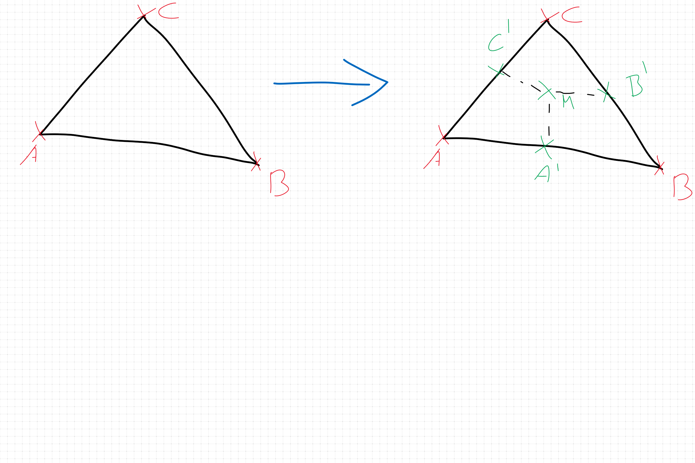

# S7 Programming and Simulation FEM-ready mesh implementation

For the Semester Programm *Programming and Simulation* we are developing a *FEM-ready* mesh class to run some simple simulations.

## Design thoughts

A mesh face should be subdividable, with custom *-maybe multiple different-* subdivision algorithms. This could allow for design iterations and design evaluations.
For *FEM*, we need to be able to efficiently query node-edge-face connections and also find neighbours for all nodes / edges / faces.
The mesh should be able to *add* and *remove* faces. Other topology operations are implemented in the *private* backing classes.

## Prerequisites

This library uses [rhino3m](https://pypi.org/project/rhino3dm/) for it's *IO* to *Rhinoceros3d*. If you want to use with a custom *IO*, this package is not needed.
Internally, the vertices are stored as *numpy* vectors, so you need to install *numpy*, too.

```shell
pip install rhino3dm
pip install numpy
```

Notably, this library **does not** rely on [Rhinocommon](https://developer.rhino3d.com/guides/rhinocommon/what-is-rhinocommon/), so it can be run as a **standalone** application, with only *open-source* and *free* libraries as dependencies.

## Features

An unorded list of features, together with their implementation status

| Feature name | implementation status |
|---|---|
| ngon-support | ✅ |
| add / remove faces | ✅ |
| subdivide faces | ✅ |
| vertex queries | ✅ |
| node queries | ✅ |
| edge queries | ✅ |
| face queries | ✅ |
| save to rhino file | ✅ |
| read from rhino file | ❌ |
| transformations | ❌ |
| finite elements | ❌ |
| analysis | ❌ |
| analysis overview | ❌ |

## Installation

There is no convenient way to install `FEMMeshPy` as a library yet, so your best bet is to clone it from *GitHub*.

```git
git clone https://github.com/DerLando/FEMMeshPy.git
```

## Usage

The library defines some top-level scripts that can be run, for example running all tests in the repo, or running the **task** script, specific to my semester project.
Of course one can only use it as a standalone application

### Top-level scripts

For now there are 3 main python scripts to execute:

 1. `run_task.py`, which runs the current implementation of the task details
 2. `run_tests.py`, which runs all tests defined in the project
 3. `run_debug.py`, which runs the current debug command

```shell
# inside of project_dir
python run_task.py
python run_tests.py
python run_debug.py
```

### Usage as a library

The simplest example usage, of building a mesh with a single triangular face

```python
from mesh import FEMMesh
import numpy as np

mesh = FEMMesh()
mesh.add_face(
    [np.array([0, 0, 0]), np.array([1, 0, 0]), np.array([0.5, 1, 0])]
)
print(f"A mesh with {mesh.face_count} faces, and {mesh.vertex_count} vertices")

```

Creating a mehs with a single, polygonal face, subdividing said face *recursively* 2 times and writing it to the *OpenNURBS* **.3dm** format

```python
from mesh import FEMMesh
from rhino_io import RhinoIO

# create a 6-sided polygon, with radius 1
mesh = FEMMesh.polygon(1, 6)

# subdivide all faces in the mesh 2 times
mesh.subdivide_faces(2)

# write the mesh to a .3dm file
RhinoIO.write_to_file(mesh, "output.3dm")
```

For additional examples, check the tests in `/test`.

## Implementation Details

A `FEMMesh` consists of *positional*, (`Vertex`) and *topological*(`Node`, `Edge`, `Face`) elements.
The `FEMMesh` class depends on it's private `Kernel`, which does all topology operations. The `Kernel` itself stores relationships of mesh elements via python `dict`s or a `OneToManyConnectionTable`. For the relationships between *Vertices* and *Nodes*, there is a special helper class, the `NodeBuffer`.

### Positional Elements

The main positional element is the `Vertex`, which is stored internally as a `np.array` of shape `(3,1)` for it's position.

### Topological Elements

The *topological* elements defined between the *positional* **Vertices** are:

- Node
- Edge
- Face

#### Node

A `Node` stores information about all `Vertex` that share a location in space. It is stored as a `set[int]` where the inner integers are the indices into the backing `Vertex` array.
This is abstracted into the `NodeBuffer` class.

#### Edge

An `Edge` spans between two `Vertex` and is **undirected**, which means it does not give any guarantees on the order in which the vertices are stored. It is stored as a `set[int]`, where the inner integers are the indices into the backing `Vertex` array.

#### Face

A `Face` is a **ordered** collection of `Vertex` instances. It is stored as an `OrderedSet[int]` where the inner integers are the indices into the backing `Vertex` array.

### Buffers

Buffers are collections of mesh elements that need to be kept in sync.

- [x] `OneToManyConnectionTable` -> Convenience one-to-many mapping
- [x] `NodeBuffer` -> Collection of nodes in space
- [x] `Kernel` -> Allows for unsafe topology operations via indices

### Kernel

The `Kernel` stores all buffers and allows for operations that have to touch multiple buffers, like adding a new face from it's vertices. It can also link *vertices* to *faces* as a *One-to-One* relationship, and *nodes* to *faces* as a *One-To-Many* relationship.

## Feature Details

For further information on individual features, refer to the following, detailed write-ups.

### Queries

The `FEMMesh` allows for most of the common queries typically run on mesh elements:

- `Vertex` -> `Node`
- `Vertex` -> `Face`
- `Node` -> Vertices
- `Node` -> Faces
- `Node` -> Node-neighbors
- `Edge` -> Vertices
- `Edge` -> Nodes
- `Edge` -> Faces
- `Face` -> Vertices
- `Face` -> Nodes
- `Face` -> Edges
- `Face` -> Face-neighbors

### Subdivision

The initial subdivision strategy is a *recursive mid-point-quad* algorithm. This basically constructs a *quad-center-fan* for a face, while also enabling to re-use the result for recursion.



### IO

The `RhinoIO` Module implements conversions from `FEMMeshPy` to a `Rhino.Geometry.Mesh`, for displaying in *Rhino*. In the future it might support different file formats, best would be a binary stream that could be de-serialized directly in the host-software of choice.

### Logging

Some of the topological operations log their status and results, but this is not consistently implemented throughout the library.
If you are running into problems, try running whith a *logger* enabled and look at the output.

### FEM

Still a bit of a black-box to me. As I understood, I need to be able to transform from *face-space* to *global-space* and back, and also be able to transform vertices with a 7x7 Rotation Matrix representing the *6 degrees of freedom*. I need to do some research on this.
